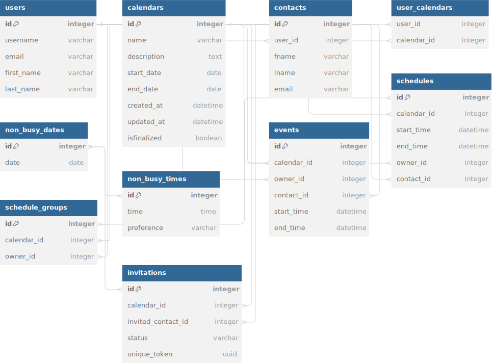

# Documentation For Appointify (P2)


## Design of Models
### Calendars
- **Description**: Represents a calendar, which is a collection of events, schedules, and availability information. 
- **Fields**:
  - `name`: The name of the calendar.
  - `description`: A brief description of the calendar (optional).
  - `start_date`: The start date of the calendar's effective period.
  - `end_date`: The end date of the calendar's effective period.
  - `created_at`: Timestamp of when the calendar was created, automatically set.
  - `updated_at`: Timestamp of the last update to the calendar, automatically updated.
  - `isfinalized`: A boolean flag indicating whether the calendar has been finalized and no more changes are allowed.

### UserCalendars
- **Description**: Associates users with calendars, indicating ownership or participation. Supports many-to-many relationships between `User` and `Calendars`.
- **Fields**:
  - `user`: ForeignKey to the `User` model, indicating the user associated with a calendar.
  - `calendar`: ForeignKey to the `Calendars` model, indicating the calendar associated with a user.
  - `non_busy_dates`: ManyToManyField linking to `NonBusyDate`, indicating the user's non-busy dates within the context of this calendar.

### NonBusyDate
- **Description**: Represents a date on which a user is available or not busy.
- **Fields**:
  - `date`: The specific date of availability.
  - `non_busy_times`: ManyToManyField to `NonBusyTime`, indicating specific times on this date when the user is available.

### NonBusyTime
- **Description**: Represents specific times on a non-busy date when a user is available.
- **Fields**:
  - `time`: The specific time of availability.
  - `preference`: A choice field indicating the user's preference level (high, medium, low) for scheduling during this time.

### Contact
- **Description**: Represents a contact, potentially another user, that can be invited to events or for scheduling.
- **Fields**:
  - `user`: ForeignKey to `User`, indicating the owner of this contact.
  - `fname`: The first name of the contact.
  - `lname`: The last name of the contact.
  - `email`: The email address of the contact, unique across the system.
  - `is_registered`: A boolean indicating whether the contact is a registered user of the system.

### Event
- **Description**: Represents an event scheduled within a calendar.
- **Fields**:
  - `calendar`: ForeignKey to `Calendars`, indicating the calendar this event belongs to.
  - `owner`: ForeignKey to `User`, indicating the user who owns/created this event.
  - `contact`: ForeignKey to `Contact`, indicating the contact associated with this event.
  - `start_time`: The start time of the event.
  - `end_time`: The end time of the event.

### Schedule
- **Description**: Represents a specific scheduled time slot within a calendar.
- **Fields**:
  - `calendar`: ForeignKey to `Calendars`, indicating the associated calendar.
  - `start_time`: The start time of the schedule.
  - `end_time`: The end time of the schedule.
  - `owner`: ForeignKey to `User`, indicating the user who owns this schedule.
  - `contact`: ForeignKey to `Contact`, indicating the contact associated with this schedule.

### ScheduleGroup
- **Description**: Represents a group of schedules that are related or created together as a set.
- **Fields**:
  - `schedules`: ManyToManyField to `Schedule`, including all schedules that are part of this group.
  - `calendar`: ForeignKey to `Calendars`, indicating the associated calendar.
  - `owner`: ForeignKey to `User`, indicating the owner of this schedule group.

### Invitation
- **Description**: Represents an invitation sent to a contact for participation in a calendar's events.
- **Fields**:
  - `calendar`: ForeignKey to `Calendars`, indicating the associated calendar.
  - `invited_contact`: ForeignKey to `Contact`, indicating the invited contact.
  - `status`: A choice field indicating the status of the invitation (pending, declined, accepted).
  - `unique_token`: A UUID field used for unique identification or verification purposes.
  - `invited_contact_non_busy_dates`: ManyToManyField to `NonBusyDate`, optionally linking to dates when the invited contact is available.

## ERD 


## API Endpoints
### Login User
- Endpoint: auth/login
- Method: POST
- Description: Endpoint for User Authentication and Login.
- Request Parameters: 
	“Username” -  The username of the user.
	“Password” - The password of the user.

Example:
Request: auth/login
```json
{
    "username": "razeen",
    "password": "razeenali"
}
```
Response: 
	200 OK


### Signup User
- Endpoint: auth/signup
- Method: POST
- Description: Endpoint for User Registration.
- Request Parameters: 
	“Username” -  The username of the user.
	“Password” - The password of the user.
	“Email” - The email of the user.

Example: 
Request: auth/signup
```json
{
    "username": "razeen",
    "password": "razeenali",
    "first_name": "Razeen",
    "last_name": "Ali",
    "email": "work@razeenali.com"
}
```
Response:
```json
{
    "username": "razeen1"
}
```
Calendars - API Endpoints
### View List of Calendars 
- Endpoint: calendars/all
- Method: GET
- Description: Display list of calendars for authenticated user.

Example:
Request: GET calendars/all
Response: 
```json
{
    "id": 1,
    "name": "Sample Calendar",
    "description": "Sample description",
    "start_date": "2024-03-01",
    "end_date": "2024-03-31",
    "created_at": "2024-03-09T10:00:00Z", 
    "updated_at": "2024-03-09T10:30:00Z"
}
```
### Create Calendar 
- Endpoint: calendars/create/
- Method: POST
- Description: create a calendar for authenticated user.

Example:

Request: POST calendars/create/
```json
{
    "name": "Sample Calendar",
    "description": "Sample description",
    "start_date": "2024-03-01",
    "end_date": "2024-03-31"
}
```
Response: 
```json
{
    "id": 1,
    "name": "Sample Calendar",
    "description": "Sample description",
    "start_date": "2024-03-01",
    "end_date": "2024-03-31",
    "created_at": "2024-03-09T10:00:00Z", 
    "updated_at": "2024-03-09T10:30:00Z"
}
```
### Update Calendar
- Endpoint: calendars/update/<int:pk>/
- Method: PUT
- Description: update specific calendar for authenticated user.
- URL Params: pk is the calendar id.

Example:

Request: PUT calendars/update/1/
```json
{
    "name": "Birthday Calendar",
    "description": "Sample description",
    "start_date": "2024-03-01",
    "end_date": "2024-03-31",
}
```
Response: 
```json
{
    "id": 1,
    "name": "Birthday Calendar",
    "description": "Sample description",
    "start_date": "2024-03-01",
    "end_date": "2024-03-31",
    "created_at": "2024-03-09T10:00:00Z", 
    "updated_at": "2024-03-09T10:30:00Z"
}
```
### View All Calendars with Preferences 
- Endpoint: calendars/user-calendars/
- Method: GET
- Description: view all calendars with preferences for authenticated user.

Example:

Request: GET calendars/user-calendars/

Response: 
```json
{
    {
        "id": 1,
        "user": 1,
        "calendar": 1,
        "non_busy_dates": [
            {
            "id": 1,
            "date": "2024-03-05",
            "non_busy_times": [
                {
                "id": 1,
                "time": "12:00:00",
                "preference": "high"
                }
            ]
            }
        ]
    }
}
```
### Update User Preferences for a specific calendar (AFTER CREATION OF CALENDAR)
- Endpoint: calendars/user-calendars/<int:cid>/update/
- Method: PUT, PATCH
- Description: update user preferences ( nonbusy date and nonbusy time) for a specific calendar for authenticated user.
- URL Params: cid is the calendar id.


Example:

Request: POST calendars/user-calendars/18/update/
```json
{
    {
        "non_busy_dates": [
            {
            "id": 1,
            "date": "2024-03-05",
            "non_busy_times": [
                {
                "id": 1,
                "time": "12:00:00",
                "preference": "low"
                }
            ]
            }
        ]
    }
}
```
Response: 
```json
{
    {
        "id": 1,
        "user": 1,
        "calendar": 1,
        "non_busy_dates": [
            {
            "id": 1,
            "date": "2024-03-05",
            "non_busy_times": [
                {
                "id": 1,
                "time": "12:00:00",
                "preference": "low"
                }
            ]
            }
        ]
    }
}
```

### Delete User Calendar along with preferences
- Endpoint: calendars/user-calendars/<int:pk>/delete/
- Method: DELETE
- Description: delete specific calendar with all user preferences.
- URL Params: pk is the calendar id.


Contacts - API Endpoints

### View List of Contacts
- Endpoint: `/api/contacts/`
- Method: GET
- Description: Display list of contacts for the authenticated user.

Example:

Request: `GET /api/contacts/`

Response:
```json
[
    {
        "id": 1,
        "fname": "Victor",
        "lname": "Ma",
        "email": "victor.ma@example.com"
    },
    {
        "id": 2,
        "fname": "Neha",
        "lname": "Sohail",
        "email": "neha.sohail@example.com"
    },
    {
        "id": 3,
        "fname": "Dev",
        "lname": "Singhvi",
        "email": "dev.singhvi@example.com"
    },
    {
        "id": 4,
        "fname": "Razeen",
        "lname": "Ali",
        "email": "razeen.ali@example.com"
    }
]
```

### Create Contact
- Endpoint: `/api/contacts/create/`
- Method: POST
- Description: Create a new contact for the authenticated user.

Example:

Request: `POST /api/contacts/create/`

```json
{
    "fname": "Alice",
    "lname": "Smith",
    "email": "alice.smith@example.com"
}
```

Response:
```json
{
    "id": 5,
    "fname": "Alice",
    "lname": "Smith",
    "email": "alice.smith@example.com"
}
```

### Update Contact
- Endpoint: `/api/contacts/update/<int:pk>/`
- Method: PUT, PATCH
- Description: Update specific contact details for the authenticated user.
- URL Params: `pk` is the contact ID.

Example:

Request: `PATCH /api/contacts/update/5/`

```json
{
    "lname": "Johnson"
}
```

Response:
```json
{
    "id": 5,
    "fname": "Alice",
    "lname": "Johnson",
    "email": "alice.smith@example.com"
}
```

### View Single Contact
- Endpoint: `/api/contacts/<int:pk>/`
- Method: GET
- Description: View details of a single contact for the authenticated user.
- URL Params: `pk` is the contact ID.

Example:

Request: `GET /api/contacts/5/`

Response:
```json
{
    "id": 5,
    "fname": "Alice",
    "lname": "Johnson",
    "email": "alice.smith@example.com"
}
```

### Delete Contact
- Endpoint: `/api/contacts/<int:pk>/delete/`
- Method: DELETE
- Description: Delete a specific contact.
- URL Params: `pk` is the contact ID.

Example:

Request: `DELETE /api/contacts/5/delete/`

Response:
```json
{
    "message": "Contact deleted successfully."
}
```

Events
### Get All Info for a Calendar
- Endpoint: events/availability_data?calendar_id=pk
- Method: GET
- Description: Invite a user to a specific calendar.
- URL Params: `pk` is the calendar ID.
- Response:
```json
[
    {
        "user_id": "razeen",
        "user_non_busy_dates": [
            {
                "id": 1,
                "non_busy_times": [
                    {
                        "id": 1,
                        "time": "18:00:00",
                        "preference": "low"
                    },
                    {
                        "id": 2,
                        "time": "16:00:00",
                        "preference": "high"
                    },
                    {
                        "id": 3,
                        "time": "16:00:00",
                        "preference": "low"
                    },
                    {
                        "id": 4,
                        "time": "18:00:00",
                        "preference": "high"
                    }
                ],
                "date": "2025-05-05"
            },
            {
                "id": 2,
                "non_busy_times": [
                    {
                        "id": 1,
                        "time": "18:00:00",
                        "preference": "low"
                    },
                    {
                        "id": 2,
                        "time": "16:00:00",
                        "preference": "high"
                    }
                ],
                "date": "2024-05-05"
            }
        ]
    },
    {
        "accepted": [
            {
                "id": 2,
                "fname": "Dev",
                "lname": "S",
                "email": "dev@mail.com",
                "status": "accepted",
                "non_busy_dates": [
                    {
                        "id": 1,
                        "non_busy_times": [
                            {
                                "id": 1,
                                "time": "18:00:00",
                                "preference": "low"
                            },
                            {
                                "id": 2,
                                "time": "16:00:00",
                                "preference": "high"
                            },
                            {
                                "id": 3,
                                "time": "16:00:00",
                                "preference": "low"
                            },
                            {
                                "id": 4,
                                "time": "18:00:00",
                                "preference": "high"
                            }
                        ],
                        "date": "2025-05-05"
                    },
                    {
                        "id": 3,
                        "non_busy_times": [
                            {
                                "id": 2,
                                "time": "16:00:00",
                                "preference": "high"
                            },
                            {
                                "id": 5,
                                "time": "10:00:00",
                                "preference": "low"
                            }
                        ],
                        "date": "2025-05-04"
                    }
                ]
            },
            {
                "id": 1,
                "fname": "Raz",
                "lname": "A",
                "email": "raz@mail.com",
                "status": "accepted",
                "non_busy_dates": [
                    {
                        "id": 1,
                        "non_busy_times": [
                            {
                                "id": 1,
                                "time": "18:00:00",
                                "preference": "low"
                            },
                            {
                                "id": 2,
                                "time": "16:00:00",
                                "preference": "high"
                            },
                            {
                                "id": 3,
                                "time": "16:00:00",
                                "preference": "low"
                            },
                            {
                                "id": 4,
                                "time": "18:00:00",
                                "preference": "high"
                            }
                        ],
                        "date": "2025-05-05"
                    },
                    {
                        "id": 3,
                        "non_busy_times": [
                            {
                                "id": 2,
                                "time": "16:00:00",
                                "preference": "high"
                            },
                            {
                                "id": 5,
                                "time": "10:00:00",
                                "preference": "low"
                            }
                        ],
                        "date": "2025-05-04"
                    }
                ]
            }
        ],
        "declined": [],
        "pending": []
    }
]
```

### Get Suggested Schedules
- Endpoint: events/create_event?calendar_id=1
- Method: GET
- Description: Get suggested schedules a specific calendar.
- URL Params: `pk` is the calendar ID.
- Response:
```json
{
    "schedule_groups": [
        {
            "schedule_group_id": 3,
            "schedules": [
                {
                    "schedule_id": 5,
                    "date": "2025-05-05",
                    "time": "16:00:00",
                    "owner": "razeen",
                    "contact": "Dev"
                },
                {
                    "schedule_id": 6,
                    "date": "2025-05-05",
                    "time": "18:00:00",
                    "owner": "razeen",
                    "contact": "Raz"
                }
            ]
        },
        {
            "schedule_group_id": 4,
            "schedules": [
                {
                    "schedule_id": 7,
                    "date": "2025-05-05",
                    "time": "18:00:00",
                    "owner": "razeen",
                    "contact": "Dev"
                },
                {
                    "schedule_id": 8,
                    "date": "2025-05-05",
                    "time": "16:00:00",
                    "owner": "razeen",
                    "contact": "Raz"
                }
            ]
        }
    ]
}
```
### Finalize Schedule
- Endpoint: events/create_event/
- Method: POST
- Description: Finalize an event
- Payload:
```json
{
    "calendar_id":1,
    "schedule_group_id": 4
}
```
- Response:
```json
{
    "detail": "Events created and calendar finalized successfully.",
    "events": [
        {
            "event_id": 1,
            "start_time": "2025-05-05 18:00:00",
            "end_time": "2025-05-05 19:00:00",
            "contact": "Dev"
        },
        {
            "event_id": 2,
            "start_time": "2025-05-05 16:00:00",
            "end_time": "2025-05-05 17:00:00",
            "contact": "Raz"
        }
    ]
}
```

### Invite User to Calendar
- Endpoint: notify/calendars/invite/
- Method: POST
- Description: Invite a user to a specific calendar.
- Payload:
```json
{
    "calendar_id": 1,
    "contact_id": 4
}
```
- Response:
```json
{
    "detail": "Invitation email sent successfully to user@mail.com",
    "invitation": {
        "id": 4,
        "calendar": 1,
        "invited_contact": 4,
        "status": "pending",
        "invited_contact_non_busy_dates": [],
        "unique_token": "22ac6b7d-98f8-46e3-b372-5cb85d78a305"
    }
}
```
### Send Reminder
- Endpoint: notify/calendars/reminder/
- Method: POST
- Description: Send a reminder email for a pending invitation.
- Payload:
```json
{
    "calendar_id": 1,
    "contact_id": 4
}
```
- Response:
```json
{
    "detail": "Reminder email sent successfully to user@mail.com",
    "invitation": {
        "id": 4,
        "calendar": 1,
        "invited_contact": 4,
        "status": "pending",
        "invited_contact_non_busy_dates": [],
        "unique_token": "22ac6b7d-98f8-46e3-b372-5cb85d78a305"
    }
}
```
### Notify Finalized Schedule
- Endpoint: notify/calendars/notify_finalized/
- Method: GET
- Description: Notify all users of a finalized schedule/event.
- Payload:
```json
{
    "calendar_id": 1
}
```
- Response:
```json
{
    "message": "Notifications sent to all contacts",
    "events": [
        {
            "id": 6,
            "calendar": 1,
            "start_time": "2025-05-05T16:00:00Z",
            "end_time": "2025-05-05T17:00:00Z",
            "contact_email": "user@mail.com",
            "contact_full_name": "User S"
        }
    ]
}
```
### View Status
- Endpoint: notify/calendars/status/?status=<status>&calendar_id=<pk>
- Method: GET
- Description: View the status of invitations for calendars.
- Query Parameters: `status` is the status of the invitation, `calendar_id` is the calendar ID.
- Response:
```json
{
    "count": 1,
    "next": null,
    "previous": null,
    "results": [
        {
            "calendar_id": 1,
            "status": "accepted",
            "usernames": [
                "user1",
                "user2"
            ]
        }
    ]
}
```

### Invited User Landing
- Endpoint: notify/invited_user_landing/<uuid:unique_link>/
- Method: GET, POST
- Description: Get owner's preferences on GET, save availability data on POST.
- Response (GET):
```json
{
    "owner_preferences": [
        {
            "id": 1,
            "non_busy_times": [
                {
                    "id": 4,
                    "time": "16:00:00",
                    "preference": "low"
                },
                {
                    "id": 34,
                    "time": "18:00:00",
                    "preference": "high"
                }
            ],
            "date": "2025-05-05"
        },
        {
            "id": 14,
            "non_busy_times": [
                {
                    "id": 36,
                    "time": "16:00:00",
                    "preference": "high"
                },
                {
                    "id": 37,
                    "time": "18:00:00",
                    "preference": "low"
                }
            ],
            "date": "2024-05-05"
        }
    ],
    "invitation": {
        "id": 2,
        "calendar": 1,
        "invited_contact": 2,
        "status": "accepted",
        "invited_contact_non_busy_dates": [],
        "unique_token": "72817e4c-1450-4ef9-b78c-ee3d1120015c"
    }
}
```
- Payload (POST):
```json
{
    "non_busy_dates": [
        {
            "date": "2025-05-05",
            "non_busy_times": [
                {
                    "time": "16:00:00",
                    "preference": "low"
                },
                {
                    "time": "18:00:00",
                    "preference": "high"
                }
            ]
        },
        {
            "date": "2025-05-04",
            "non_busy_times": [
                {
                    "time": "10:00:00",
                    "preference": "low"
                },
                {
                    "time": "16:00:00",
                    "preference": "high"
                }
            ]
        }
    ]
}
```
- Response (POST):
```json
{
    "detail": "user1 preferences updated for this calendar",
    "invitation": {
        "id": 2,
        "calendar": 1,
        "invited_contact": 2,
        "status": "accepted",
        "invited_contact_non_busy_dates": [
            {
                "id": 18,
                "non_busy_times": [
                    {
                        "id": 33,
                        "time": "16:00:00",
                        "preference": "low"
                    },
                    {
                        "id": 34,
                        "time": "18:00:00",
                        "preference": "high"
                    },
                    {
                        "id": 36,
                        "time": "16:00:00",
                        "preference": "high"
                    },
                    {
                        "id": 37,
                        "time": "18:00:00",
                        "preference": "low"
                    }
                ],
                "date": "2025-05-05"
            },
            {
                "id": 19,
                "non_busy_times": [
                    {
                        "id": 35,
                        "time": "10:00:00",
                        "preference": "low"
                    },
                    {
                        "id": 36,
                        "time": "16:00:00",
                        "preference": "high"
                    }
                ],
                "date": "2025-05-04"
            }
        ],
        "unique_token": "72817e4c-1450-4ef9-b78c-ee3d1120015c"
    }
}
```
### Invited User Decline
- Endpoint: notify/invited_user_landing/<uuid:unique_link>/decline
- Method: GET
- Description: Declines a users availability for a calendar on GET.
- Response (GET):
```json
{
    "detail": "Invitation declined successfully",
    "invitation": {
        "id": 2,
        "calendar": 1,
        "invited_contact": 2,
        "status": "declined",
        "invited_contact_non_busy_dates": [
            {
                "id": 18,
                "non_busy_times": [
                    {
                        "id": 33,
                        "time": "16:00:00",
                        "preference": "low"
                    },
                    {
                        "id": 34,
                        "time": "18:00:00",
                        "preference": "high"
                    },
                    {
                        "id": 36,
                        "time": "16:00:00",
                        "preference": "high"
                    },
                    {
                        "id": 37,
                        "time": "18:00:00",
                        "preference": "low"
                    }
                ],
                "date": "2025-05-05"
            },
            {
                "id": 19,
                "non_busy_times": [
                    {
                        "id": 35,
                        "time": "10:00:00",
                        "preference": "low"
                    },
                    {
                        "id": 36,
                        "time": "16:00:00",
                        "preference": "high"
                    }
                ],
                "date": "2025-05-04"
            }
        ],
        "unique_token": "72817e4c-1450-4ef9-b78c-ee3d1120015c"
    }
}
```